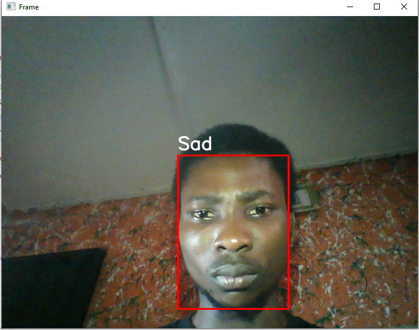
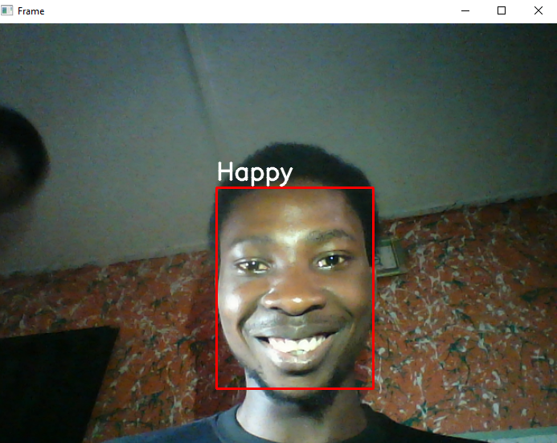
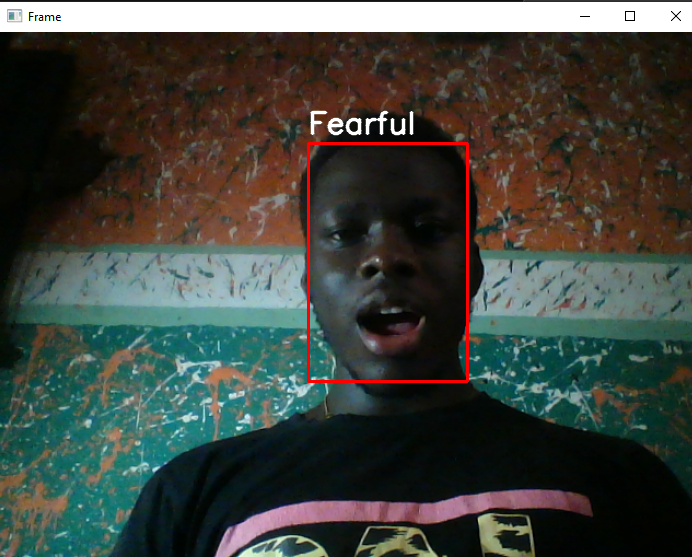

# Face-emotion-detection
This project is a face emotion detection system using the VGG16 model and the dataset used is the FER13 dataset which can be gotten from Kaggle. The goal of the system is to accurately recognize emotions from facial expressions in real time.
The FER13 dataset is a widely used dataset for training emotion detection models, containing images of faces labeled with one of seven emotions (angry, disgust, fear, happy, neutral, sad, surprise).

# Dependencies
* Tensorflow
* Opencv
* keras

# File description
* model_training.ipynb - Data exploration, pre-processing and modelling was done here
* test.ipynb - contains code to detect facial expression in realtime using webcam
* models - contains the caffe model, which was used for face detection and also the trained model (can be requested for)

# Testing example

